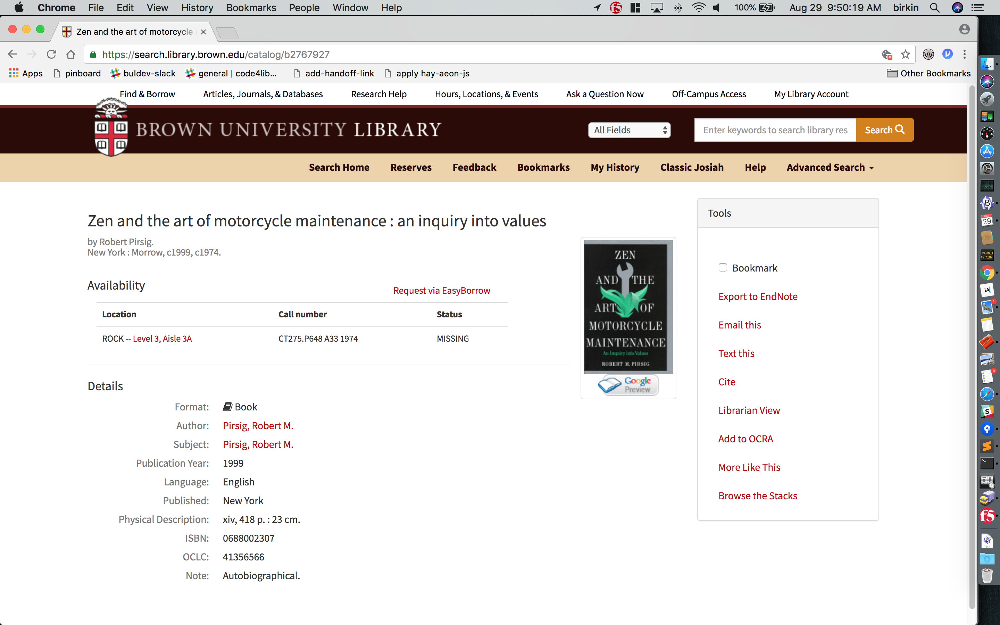
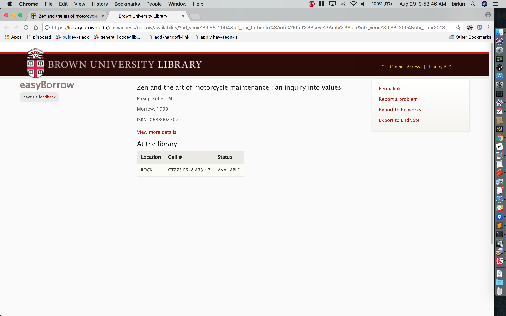

2018-Aug-31 - dev-meeting
=========================

### easyA fix

- Issue...
    - user arrives at a bib-page: 
    - since the item is 'missing', a helpful easyBorrow link appears
    - clicking the easyBorrow link lands the user at a page with a few problems: 
        - no 'Request' button appears, because there is an available copy, teasingly previewed to the user
        - but the 'View more details' link returns the user to the page that shows the missing copy! A circular maddening vortex.
    - the reason..
        - the old availability-api that easyAccess called assumed an isbn would have a single bib; in this case [b2767927](https://search.library.brown.edu/catalog/b2767927). (This is true for the majority of times.)
        - the availability-api holdings for that isbn shows an 'available' copy -- so the easyBorrow request button doesn't appear
        - however, the old availability-api doesn't realize that the available copy is for a different bib, [b1815113](https://search.library.brown.edu/catalog/b1815113), hence the problem

- Solution...
    - the [new availability-api](https://library.brown.edu/availability_api/v1/isbn/0688002307/) clearly shows what holdings go with what bib, so easyAccess can return the user to the available copy

---
---

2018-Aug-24 - dev-meeting
=========================

### project update script

- Issue: began getting an error message when running my update script, something like:

        sudo: unable to execute /bin/chmod: Argument list too long

- Solution: turns out that the [line](https://gist.github.com/birkin/5014164#file-update_django_app-sh-L33) where I get all the files in the directory -- ends up being too long.
    - One solution that works, but ends up processing each file individually and is very, very slow...
        - change the line:

                find "$i" -type f | xargs sudo /bin/chmod u=rw,g=rw,o=r

            ...to:

                nice find "$i" -type f -print0 | xargs -0 -L 1 sudo /usr/bin/chmod u=rw,g=rw,o=r

    - The solution I'm using for now is [this](https://gist.github.com/birkin/5014164#file-update_django_app_2-sh)
        - for each main directory, get all the subdirectories, and then for each subdirectory, send all the files within that subdirectory (no recursion) as arguments to the chmodder.
        - this isn't instantaneous, but is much, _much_ faster than the one-line `-L 1` solution.

- Notes...
    - the unix [time](https://hackernoon.com/usr-bin-time-not-the-command-you-think-you-know-34ac03e55cc3) command confirms the printed dots aren't slowing things down the way that printing sometimes can:

            $ time bash ./the_update_script.sh
            Already up-to-date.

            0 static files copied to ''/the/media/dir'', 100 unmodified.

            chmod/chgrp-ing main directory:
            /main/dir/A
            setting group for this directory
            processing subdirectories...
            .

            chmod/chgrp-ing main directory:
            /main/dir/B
            setting group for this directory
            processing subdirectories...
            ..............................................................................................................................................................................................................................................................................................................................

            real    0m17.574s
            user    0m7.546s
            sys 0m10.294s
            $

    - This too-many-args occured on the production server, but not the dev server, which surprised me, because I thought git would have made them pretty identical. There were a bunch more git files on the production server than the dev server, and the dev server had a couple of git 'pack' files that production didn't.
        - Turns out git can autogenerate [packfiles](https://git-scm.com/book/en/v2/Git-Internals-Packfiles). This can save space, and, IIRC, can sometimes also reduce the total number of files. I rarely push to github from anything other than my localdev box, but probably did at some point from server-dev, which packed some git files together.

---
---

### minimal django

Based on minimal-django code that B.C. long ago experimented with, based, I think, on some code in the book "[Lightweight Django](https://www.amazon.com/Lightweight-Django-Using-WebSockets-Backbone/dp/149194594X/)" (which we have a copy of, thanks to J.R.), I've incorporated into my [django template code](https://github.com/birkin/django_template_project), from which I start all my django projects, a [minimal settings file](https://github.com/birkin/django_template_project/blob/master/config/settings_min.py), unused by default.

I'm using this for a [project](https://github.com/birkin/includes_test), and just attempted to run the test-framework, in preparation for writing a test, and got a db-error -- and remembered that there was a way I'd worked around this in the past. So I began trying to reflect upon, first, which of my django projects are lightweight, to then see how I'd implemented tests.

But then I noticed I'd built the solution into the very [tests.py](https://github.com/birkin/django_template_project/blob/master/app_x/tests.py#L5) file I was working with!

---
---

2018-Aug-17 - dev-meeting
=========================

no meeting

---
---

2018-Aug-10 - dev-meeting
=========================

### runserver vs apache-server

##### issue...

Difference in handling encoding of non-ascii characters in a url.

- localhost runserver...

    - url... `<a href="καὶ_.html">καὶ</a>`

    - request.META['PATH_INFO']: '/proxy/grc/καὶ_.html/'

    - log showing passed urls.py regex capture: [06/Aug/2018 14:57:02] DEBUG [views-proxy()::33] slug, `grc/καὶ_.html`

- dev-server...

    - url... `<a href="καὶ_.html">καὶ</a>`

    - request.META['PATH_INFO']: '/proxy/grc/%25ce%25ba%25ce%25b1%25e1%25bd%25b6_.html/'

    - log showing passed urls.py regex capture: [06/Aug/2018 14:34:28] DEBUG [views-proxy()::33] slug, `grc/%25ce%25ba%25ce%25b1%25e1%25bd%25b6_.html`

##### solution...

Force an unquote...

    >>>
    >>> import urllib.parse
    >>>
    >>> s = '%ce%ba%ce%b1%e1%bd%b6_.html'
    >>>
    >>> urllib.parse.unquote_plus( s )
    'καὶ_.html'
    >>>
    >>> s2 = 'καὶ_.html'
    >>>
    >>> urllib.parse.unquote_plus( s2 )
    'καὶ_.html'
    >>>
    >>> x = urllib.parse.unquote_plus( s2 )
    >>>
    >>> x == s2
    True
    >>>

---
---

### logging django-ORM database-calls

##### background...

I'd known there were a few ways to see the actual sql queries django makes. But the ones I was aware of required installs. I hadn't know there was a simple way requiring no external installs...

##### solution...

_(From [link](https://medium.com/@hakibenita/things-you-must-know-about-django-admin-as-your-app-gets-bigger-6be0b0ee9614) off of another django-admin article, by the same author, that J.R. slack-posted.)_

Here is a typical logging entry from a project's settings.py file...

    LOGGING = {
        'version': 1,
        'disable_existing_loggers': True,
        'formatters': {
            [snip]
            },
        },
        'handlers': {
            'logfile': {
                [snip]
            },
            'console':{
                [snip]
            },
        },
        'loggers': {
            'name_of_app': {
                'handlers': ['logfile'],
                'level': os.environ.get(u'LOG_LEVEL'),
                'propagate': False
            },
        }
    }

Simply add an entry to the 'loggers' section so that it looks like this...

    LOGGING = {
        'version': 1,
        'disable_existing_loggers': True,
        'formatters': {
            [snip]
            },
        },
        'handlers': {
            'logfile': {
                [snip]
            },
            'console':{
                [snip]
            },
        },
        'loggers': {
            'name_of_app': {
                'handlers': ['logfile'],
                'level': os.environ.get(u'LOG_LEVEL'),
                'propagate': False
            },
            'django.db.backends': {
                'handlers': ['logfile'],
                'level': os.environ.get(u'LOG_LEVEL'),
                'propagate': False
            },
        }
    }

...and the result is that you'll see the sql for all your app's db calls, right in your log! (You could also log at a different level, or to a different file.)

---
---

2018-Aug-03 - dev-meeting
==========================

### lazy troubleshooting

##### Issue...

An old project had stopped working due to a server migration. I recently got it working again, and then decided to upgrade the project's version of django.

It was a big jump and I addressed the usual such issues. But one stumped me for a while. In retrospect, I can now see that had I paid more attention to the traceback, I could have zeroed in on the location of the problem more quickly. But the traceback contained solely django & python error entries -- rather than indicators of where in _my_ code the problem lay -- so I dove into the view function in question and added logging. And added more logging. And more.

The surprising issue was that the view was returning a _good_ response -- yet the error persisted.

##### Solution...

By forcing a `return HttpResponse( 'foo' )` at various places in the code, I narrowed the possibilities. It turned out that the code was updating the session, and one element of the updated session was a datetime object. That object is not serializable in the current version of django, but was in the earlier version. The tricky part was that the session-update was only processed by the django middleware _after_ the response had been returned.

My take-aways...
- Treat library-only tracebacks more like a grownup.
- Be aware of how what I 'know' can get in the way of troubleshooting.
- Be aware of (not necessarily 'wary of') [lazy evaluation](https://en.wikipedia.org/wiki/Lazy_evaluation). Django does this in a few places, most notably in it's [database-query code](https://docs.djangoproject.com/en/2.0/topics/db/queries/#querysets-are-lazy). And perhaps this example -- where the set-session code created an object acted on later -- isn't exactly an issue of lazy-evaluation. But it's conceptually similar, and my discernment was slowed by the non-procedural timing of the blow-up.
    - Interesting aside, from a 2009 [blog post](http://blog.brendel.com/2009/06/pitfalls-of-lazy-validation-in-djangos.html) on 'the pitfalls of lazy validation'...

        "It is not uncommon to retrieve a set of results via a query set and then perform some operations on them, for example in a loop. It is tempting to view query sets just as if they were arrays - lists of in-memory objects - and use them in a similar manner. In-memory arrays tend to be quite efficient, query sets not so much: If you have to run over such a loop several times, you will end up retrieving the same object from the database multiple times as well."

            my_set = MyModel.objects.all() # No database access
            print my_set[0]                # DB access and model instantiation...
            print my_set[0]                # ... and the same again!

        "If you need to iterate over the result set more than once - or just access the same element a few times - it is therefore more efficient to make copies of your individual results. That way, the query and the creation of model instance objects is done only once."

            my_set = [ m for m in MyModel.objects.all() ] # DB accessed for all
            print my_set[0]                               # No DB access!

##### Aside...

One of the tracebacks showed the failure occuring on the attempt by django to serialize the datetime object, and I could see from the code-snippet in the traceback that a JSONSerializer class was attempting to encode to 'latin-1'. The encoding had nothing to do with the error but threw me for a loop (as a passionate unicode/utf-8 evangelist). But it's not the main `json.dumps` serializer -- it's one specifically for url-safe actions. The [class](https://github.com/django/django/blob/master/django/core/signing.py#L81-L90); the [explanation](https://github.com/django/django/blob/master/django/core/signing.py#L2-L7).

---
---
