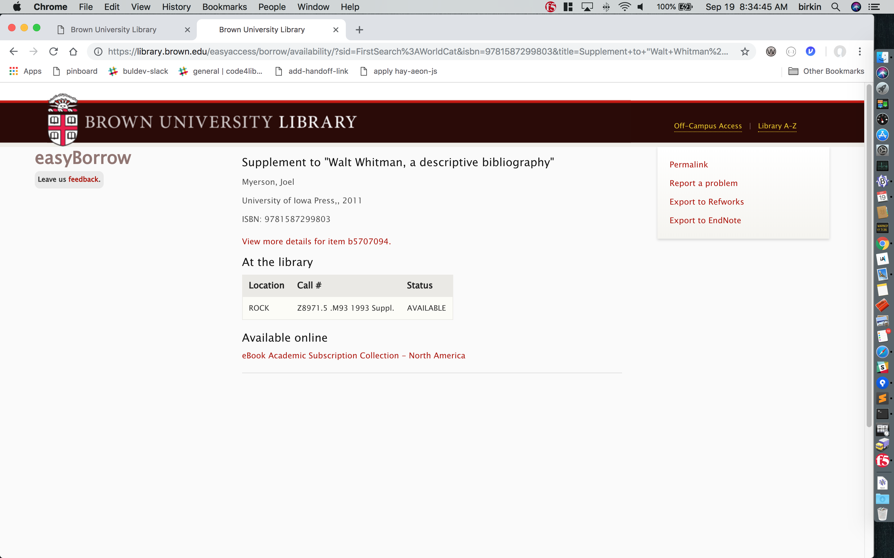
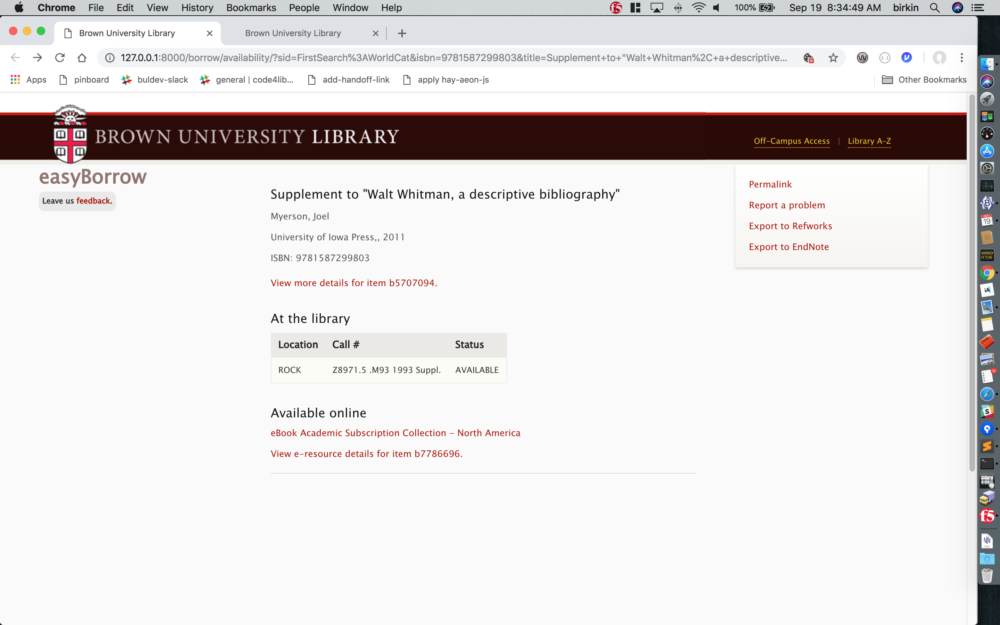

2018-Oct-19 - dev-meeting
=========================

### django++, colleagues++

Some easyAccess tests failed after I'd updated a template. Updating them, I ran into the situation where testing for the string `<title>easyAccess</title>` in returned html failed -- because the newer html was actually returning:

    <title>
        easyAccess
    </title>

A few years ago at a code4lib dinner, J.R. made a passing comment that's stuck with me, something like: "Tests should check functionality, not implementation." So how to do _that_, here? Initially, I used the wonderful html-parsing library [BeautifulSoup](https://www.crummy.com/software/BeautifulSoup/). Example, [here](https://github.com/Brown-University-Library/easyaccess_project/blob/82f1b29cba0f3893549923bf153d4bc1e08aa543/findit/tests/test_views.py#L69-L72).

Then B.C. told me that Django has an [assertInHTML()](https://docs.djangoproject.com/en/1.11/topics/testing/tools/#django.test.SimpleTestCase.assertInHTML) function that might also be useful in this situation. I ended up [using that](https://github.com/Brown-University-Library/easyaccess_project/blob/112c5bf675fca37fd5412cf8dbab62abb0bb3c07/findit/tests/test_views.py#L68-L72) -- which had an unintended benefit: It expects the haystack-html to be reasonably valid. It initially wasn't — and the error message pointed out an extra `
`.

---
---

### safari css

At some point I was [clearing](chrome://settings/clearBrowserData) my chrome cache. I noticed the 'Appearance' section of the settings, and saw the option to change the [default font](chrome://settings/fonts), which I did (I'm in my "Calibri" phase.)

That made me want to do the same in Safari. I didn't see a 'font' setting, but I did see an 'Advanced/Style sheet' setting. I haven't yet done this, but a quick google on how to do this yielded an [fascinating post](http://theoveranalyzed.net/2018/3/16/safaris-custom-style-sheet) by someone who recently discovered this, and decided investigate how long this feature's been around.

---

### solid

I recently heard about a project called '[Solid](https://solid.inrupt.com)' from a few different places. It's getting press because it's a project of Tim Berners-Lee. My very limited understanding is that it's a nodejs-integration with a webserver that allows individuals to write data in desired locations and maintain a great deal of control over the apps and individuals that can access defined elements of that data.

Some links:
<https://www.inrupt.com/blog/one-small-step-for-the-web>
<https://solid.inrupt.com>
<https://solid.inrupt.com/about>
<https://solid.inrupt.com/docs/app-on-your-lunch-break>

---
---

2018-Oct-12 - dev-meeting
=========================

### old 'language-translator'

No links to the old language-translator 'app', intentionally, because it's unused and I want to remove it from it's overloaded project. This is the kind of thing the [UNT Sierra-API project](https://github.com/unt-libraries/catalog-api) should expose, if the native Sierra API doesn't.

---

(had to leave early)

---
---

2018-Oct-11 - sprint-demo-meeting
=================================

### annex-hay requesting teamwork fix

- Issue...

    Annex-Hay easy-requesting was failing on a [Josiah bib](https://search.library.brown.edu/catalog/b3647974).

- Teamwork fix...

    I investigated; the hash symbol in the item-callnumber -- `Ms. Bianchi Box 1 (Inventory # 1 - 14)` -- was truncating the information that the easyrequest-hay service was able to process. Hector dove in and fixed.

---

### added online holdings

- Issue...

    easyAccess for books (easyBorrow) was showing alternate e-resources that link360 knew about, but _not_ alternate e-resources returned from the availability-api. (The reference [Josiah bib](https://search.library.brown.edu/catalog/b5707094).)

    - [availability-api results](https://library.brown.edu/availability_api/v1/isbn/9781587299803/) (see response->basics->online_holdings)
    - easyBorrow screenshot showing that the josiah e-resource info was _not_ displayed: 

- Fix...

    - I turned the online info dict from link360 into a list, and appended any online holdings from the availability-api
    - easyBorrow screenshot showing that the josiah e-resource info _is_ now displayed: 

---
---

2018-Oct-05 - dev-meeting
=========================

### availability-api progress in fits-and-starts

- Problem? No problem!

    A quick dummy test on `/isbn/123/` revealed an error. I had just found an [isbn library](https://isbnlib.readthedocs.io/en/latest/) and knew it had a validation capabilty, and so thought it would be trivial to use that for this issue. Code updated and put into production.

- "This word, `valid` -- I do not think it means what you think it means."

    A day later, I was emailed another error, on `/isbn/0415232015(cased)/`. Looking into this, I was surprised to see:

        In [1]: import isbnlib

        In [2]: isbnlib.is_isbn10( '0415232015(cased)' )
        Out[2]: True

    Turns out that function is not really doing a _full_ validity check on the string -- rather, it's saying that there is a valid isbn-10 in that string. Which is why the above passes, and the bad-isbn below fails (with or without `(cased)`)...

        In [3]: isbnlib.is_isbn10( '1234567890(cased)' )
        Out[3]: False

- Full-validity...

    More documentation reading and experimenting! The solution...

        In [4]: isbnlib.EAN13( '0415232015(cased)' )
        Out[4]: '9780415232012'

        In [5]: isbnlib.EAN13( '1234567890(cased)' )

        In [6]:

    Because this also returns a [normalized 13-character](https://en.wikipedia.org/wiki/International_Standard_Book_Number#EAN_format_used_in_barcodes,_and_upgrading) valid isbn, it meant that I had to adjust my worker and calling functions which had previous returned/expected a simple boolean.

---
---
